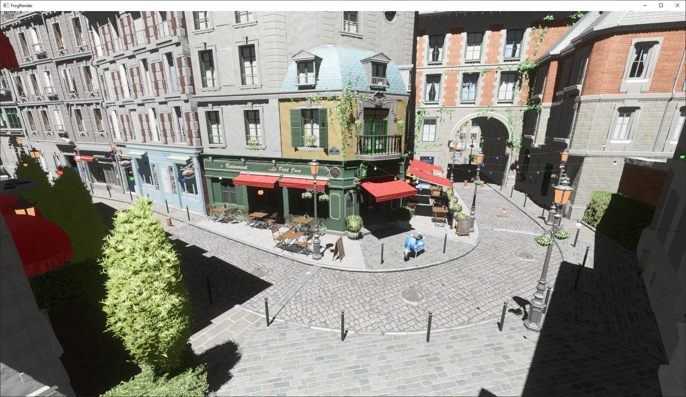

# Frogfood

A froggylicious renderer. Check out [the wiki!](https://github.com/JuanDiegoMontoya/Frogfood/wiki)

## Features

- Vulkan 1.3
- Virtual shadow mapping (henceforth VSM shall stand for it and absolutely nothing else)
- Meshlet rendering without mesh shaders
- Visibility buffer deferred rendering (the scene is drawn to a 32-bit-per-pixel visibility buffer, then a standard G-buffer is generated)
- Super basic physically-based shading
- Granular culling:
  - Meshlets: hi-z and frustum culling
  - Triangles: frustum, back-facing, and small primitive culling
- Bloom based on the implementation in [Call of Duty: Advanced Warfare](https://www.iryoku.com/next-generation-post-processing-in-call-of-duty-advanced-warfare/)
- Auto exposure based on vibes
- Mediocre but not too terrible color handling and image formation
- Epically fast glTF loading powered by [fastgltf](https://github.com/spnda/fastgltf) (on compilers that support std::execution::par (MSVC))
- HDR display support and wide gamut rendering

## OpenGL

This renderer was previously written in OpenGL 4.6. The last commit using OpenGL is 439be52. As of writing, all the mentioned features were supported in the OpenGL version (including mesh shader-less meshlet rendering and VSMs).

## Building

Get a modern version of CMake and do the `mkdir build && cd build && cmake ..` thing after cloning this repo. All dependencies are vendored or fetched with FetchContent. Should work on any sufficiently modern desktop GPU on Windows and Linux (I only test on Windows however).

## Obligatory Sponza

## Pictures That Will Become Outdated Almost Immediately

## Dependencies

### Fetched

- [GLFW](https://github.com/glfw/glfw)
- [GLM](https://github.com/g-truc/glm)
- [volk](https://github.com/zeux/volk.git)
- [vk-bootstrap](https://github.com/charles-lunarg/vk-bootstrap)
- [Vulkan Memory Allocator](https://github.com/GPUOpen-LibrariesAndSDKs/VulkanMemoryAllocator)
- [fastgltf](https://github.com/spnda/fastgltf.git)
- [KTX](https://github.com/KhronosGroup/KTX-Software.git)
- [glslang](https://github.com/KhronosGroup/glslang.git)
- [Dear ImGui](https://github.com/ocornut/imgui)
- [ImPlot](https://github.com/epezent/implot.git)
- [meshoptimizer](https://github.com/zeux/meshoptimizer.git)
- [FidelityFX Super Resolution 2](https://github.com/JuanDiegoMontoya/FidelityFX-FSR2.git) (my fork)
- [Tracy](https://github.com/wolfpld/tracy.git)

### Vendored

- [Material Design Icons](https://github.com/google/material-design-icons/)
- [Font Awesome 6](https://github.com/FortAwesome/Font-Awesome/)
- [stb_image.h](https://github.com/nothings/stb)
- [stb_include.h](https://github.com/nothings/stb) (the vendored version is heavily modified)
- [Tony McMapFace LUT](https://github.com/h3r2tic/tony-mc-mapface)
- [AgX shader](https://www.shadertoy.com/view/Dt3XDr)
- Probably several more code snippets that I've forgotten about

## Acknowledgements

Meshlet and visibility buffer rendering wouldn't have been possible without the early contributions by [LVSTRI](https://github.com/LVSTRI/).
